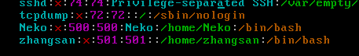

# Linux自有服务
自有服务，即不需要用户独立去安装的软件的服务，而是当系统安装好之后就可以直接使用的服务。

## 一、运行级别
运行模式也可以称之为运行级别。

```
在linux 中存在一个进程: init (initialize，初始化)，进程id 1。

查看进程: #ps -ef|grep init
```


    该进程存在一个对应的配置文件: inittab (系统运行级别配置文件，位置/etc/inittab)

文件的主要内容：


```
0 — 表示关机级别（不要将默认的运行级别设置成这个值）
1 — 单用户模式
2 — 多用户模式，不带NFS（Network File Syetem）
3 — 多用户模式，完全的多用户模式（不带桌面的，纯命令行模式）
4 — 没有被使用的模式（被保留模式）
5 — X11，完整的图形化界面模式
6 — 表示重启级别（不要将默认的运行级别设置成这个值）

与该级别相关的几个命令：
#init 0		表示关机
#init 3		表示切换到不带桌面的模式
#init 5		切换到图形界面
#init 6 		重启电脑
注意：init指令需要超级管理员的权限，普通用户无法执行。

这些命令其实都是调用的init进程，将数字（运行级别）传递给进程，进程去读配置文件执行对应的操作。
```
案例：

①切换到纯命令行模式下（临时切换，重启之后又恢复）

#init 3


切换之后需要输入用户名和密码，在输入密码的时候没有“*”提示输入，只要自己确认输入的密码没有错误，按下回车即可。

②回到桌面模式

#init 5

③设置模式永久为命令行模式


将/etc/inittab文件中的initdefault值设置成3，然后重启操作系统。
## 二、用户和用户组管理

Linux系统是一个多用户多任务的操作系统，任何一个要使用系统资源的用户，都必须首先向系统管理员申请一个账号，然后以这个账号的身份进入系统。

用户的账号一方面可以帮助系统管理员对使用系统的用户进行跟踪，并控制他们对系统资源的访问；另一方面也可以帮助用户组织文件，并为用户提供安全性保护。

每个用户账号都拥有一个惟一的用户名和各自的密码。

用户在登录时键入正确的用户名和密码后，就能够进入系统和自己的主目录。


```
要想实现用户账号的管理，要完成的工作主要有如下几个方面：

用户账号的添加、删除、修改以及用户密码的管理。
用户组的管理。

注意三个文件：
/etc/passwd				存储用户的关键信息
/etc/group				存储用户组的关键信息
/etc/shadow				存储用户的密码信息
```
### 1、用户管理
①添加用户
```
常用语法：#useradd 选项 用户名
常用选项：
	-g：表示指定用户的用户主组，选项的值可以是用户组的id，也可以是组名
	-G：表示指定用户的用户附加组，选项的值可以是用户组的id，也可以是组名
	-u：uid，用户的id（用户的标识符），系统默认会从500之后按顺序分配uid，如果不想使用系统分配的，可以通过该选项自定义【类似于腾讯QQ的自选靓号情况】
	-c comment：添加注释
```
案例：创建用户zhangsan，不带任何选项

```
验证是否成功：
	a. 验证/etc/passwd的最后一行，查看是否有zhangsan的信息；
	b. 验证是否存在家目录（在Centos下创建好用户之后随之产生一个同名家目录）；
```

扩展：认识passwd文件


```
用户名:密码:用户ID:用户组ID:注释:家目录:解释器shell

用户名：创建新用户名称，后期登录的时候需要输入；
密码：此密码位置一般情况都是“x”，表示密码的占位；
用户ID：用户的识别符；
用户组ID：该用户所属的主组ID；
注释：解释该用户是做什么用的；
家目录：用户登录进入系统之后默认的位置；
解释器shell：等待用户进入系统之后，用户输入指令之后，该解释器会收集用户输入的指令，传递给内核处理；

注意：在不添加选项的时候，执行useradd之后会执行一系列的操作
	a. 创建同名的家目录；
	b. 创建同名的用户组；
```

案例：添加选项，创建用户lisi，让lisi属于501主组，附加组500，自选靓号666。


注意：查看用户的主组可以查看passwd文件，查看附加组可以查看group文件。

②修改用户
```
常用语法：#usermod 选项 用户名
Usermod：user modify，用户修改
常用选项：
	-g：表示指定用户的用户主组，选项的值可以是用户组的id，也可以是组名
	-G：表示指定用户的用户附加组，选项的值可以是用户组的id，也可以是组名
	-u：uid，用户的id（用户的标识符），系统默认会从500之后按顺序分配uid，如果不想使用系统分配的，可以通过该选项自定义【类似于腾讯QQ的自选靓号情况】
	-l：修改用户名

案例：修改zhangsan用户主组为500，附加组改为501
#usermod -g 500 -G 501 zhangsan

案例：修改zhangsan用户用户名，改为wangerma
#usermod -l 新的用户名 旧的用户名
#usermod -l wangerma zhangsan
```
③设置密码
```
Linux不允许没有密码的用户登录到系统，因此前面创建的用户目前都处于锁定状态，需要设置密码之后才能登录计算机。

常用语法：#passwd 用户名
```
案例：设置wangerma用户的密码


在设置密码的时候也是没有任何输入提示的，放心输入，确保两次输入的密码一致，按下回车即可。

也可以使用弱密码，但是不建议，否则会看到以下的提示：


设置密码之后shadow文件中的体现：能够看出lisi用户没有密码的。


在设置用户密码之后可以登录帐号

④切换用户


```
切换用户命令：#su [用户名]	（switch user）
如果用户名不指定则表示切换到root用户。

切换用户需要注意的事项：
	a. 从root往普通用户切换不需要密码，但是反之则需要root密码；
	b. 切换用户之后前后的工作路径是不变的；
	c. 普通用户没有办法访问root用户家目录，但是反之则可以；
```
⑤删除用户
```
常用语法：#userdel 选项 用户名
userdel：user delete（用户删除）
常用选项：
	-r：表示删除用户的同时，删除其家目录；
```
案例：删除wangerma用户


注意：已经登录的wangerma用户删除的时候提示删除失败，但是没有登录的lisi用户可以正常删除。

解决办法：简单粗暴，kill对应用户的全部进程


提示：所有跟用户操作的命令（除passwd外）只有root超级管理员有权限执行。

### 2、用户组管理
每个用户都有一个用户组，系统可以对一个用户组中的所有用户进行集中管理。不同Linux 系统对用户组的规定有所不同，如Linux下的用户属于与它同名的用户组，这个用户组在创建用户时同时创建。
```
用户组的管理涉及用户组的添加、删除和修改。组的增加、删除和修改实际上就是对/etc/group文件的更新。
```

```
文件结构：

用户组名:密码:用户组ID:组内用户名

密码：X表示占位符，虽然用户组可以设置密码，但是绝大部分的情况下不设置密码；

组内用户名：表示附加组是该组的用户名称；

```
①用户组添加
```
常用语法：#groupadd 选项 用户组名
常用选项：
	-g：类似用户添加里的“-u”，-g表示选择自己设置一个自定义的用户组ID数字，如果自己不指定，则默认从500之后递增；

```
案例：使用groupadd指令创建一个新的用户组，命名为Administrators


②用户组编辑
```
常用语法：#groupmod 选项 用户组名
常用选项：
	-g：类似用户修改里的“-u”，-g表示选择自己设置一个自定义的用户组ID数字
	-n：类似于用户修改“-l”，表示设置新的用户组的名称

```
案例：修改Administrators用户组，将组ID从502改成520，将名称改为admins

③用户组删除
```
常用语法：#groupdel 用户组名
```

```
注意：当如果需要删除一个组，但是这个组是某个用户的主组时，则不允许删除；如果确实需要删除，则先从组内移出所有用户。
```
