# Linux 指令
Linux命令查询

<https://man.linuxde.net>
# 基础指令部分
## 1、ls 指令 

（list）

### 用法一：  列出文件
```
注意： ls 列出的结果颜色说明其中蓝色的名称表示文件夹，黑色的表示文件，绿色的其权限为拥有所有权限。
```
#### 列出当前目录下所有的文件/文件夹的名称
	#ls
#### 列出指定路径下的所有文件/文件夹的名称
	#ls 路径
```
路径：

绝对路径：绝对路径不需要参照物，直接从根“/ '开始寻找对应路径; 

	如 #ls /root

相对路径：相对首先得有一个参照物（一般就是当前的工作路径） ;

写法：在相对路径中通常会用到2个符号"./”[表示当前目录下]、“../" [上一级目录下]

	如 #ls ../../root
```
### 用法二 ：指定路径的文件以指定的形式列出
	#ls 选项 路径
#### 以列表形式显示详细信息，元数据信息（用户、组、大小、创建时间、权限信息、文件类型）
	#ls -l 路径
#### 查看隐藏文件
	#ls -a 路径
#### 参数并用	（列出所有文件以及隐藏文件并以列表形式显示详细信息）
	#ls -la	路径
#### 列出指定路径下的所有文件/文件夹的名称，以列表的形式并且在显示文档大小的时候以可读性较高的形式显示
	#ls -lh 路径

## 2、pwd 指令

（print working directory,打印当前工作目录）

	#pwd

## 3、cd 指令

（change directory,改变目录）

	#cd 路径

补充：
在Linux中有一个特殊的符号"~"，
表示当前用户的HOME目录。

切换的方式： #cd ~ 

## 4、mkdir 指令
（make directory,创建文件夹）
### 用法一、创建文件夹
	#mkdir 路径 （路径，可以是文件夹名称也可以是包含名称的一个完整路径）
```
案例： 在当前目录下创建文件夹"xinjianwenjianjia"

	#mkdir xinjianwenjianjia

案例： 在指定目录下创建文件夹"xinjianwenjianjia"

	#mkdir /root/xinjianwenjianjia
```
### 用法二、一次性创建多个不存在的目录，添加-p参数，否则会报错

	如 #mkdir -p ~/xinjianwenjianjia/a/b/c/d

### 用法三、 一次性创建多个文件夹
	#mkdir 路径1 路径2 路径3...
```
案例：在当前目录下创建a b c 三个文件夹

	#mkdir a b c
```
## 5、touch 指令
创建文件，和mkdir类似，仅少了用法二的操作,即不能在不存在的目录中创建文件

	#touch 文件路径 （路径可以是文件名也可以是路径）

```
案例：在当前目录创建linux1.txt文件

	#touch linux1.txt

案例：在当前目录创建多个文件

	#touch linux1.txt linux2.txt

案例：在用户的home目录创建文件linux1.txt

	#touch ~/linux1.txt
```

## 6、cp 指令
（copy，复制）

用于复制文件/文件夹到指定的目录

	#copy 被复制的文件的路径 复制到的路径
```
案例：当前目录linux1.txt复制到指定目录
	
	#cp linux1.txt /home/linux123

案例：当前目录linux1.txt复制到指定目录并重命名
	和windows不一样，linux 在复制文件的时候可以更改文件名

	#cp linux1.txt /home/linux123/linux2.txt

案例：复制一个文件夹到指定目录
	注意：当使用cp命令进行文件夹复制操作的时候需要添加选项“r”[-r表示递归复制]，否则目录将被忽略

	#cp -r ./xinjianwenjianjia /home/linux123

	复制文件夹也可以重命名文件夹 但不建议
```
## 7、mv 指令
（move，移动，剪切）
	
	#mv 需要移动的文档路径 需要保存的位置路径
```
案例：使用mv命令移动一个文件

	#mv linux1.txt ~/xinjianwenjianjia

案例：使用mv命令移动一个文件夹

	#mv ~/xinjianwenjianjia ~/xinjianwenjianjia1

案例：重命名
	重命名的新名字不能是目录中已有文件夹名，否则会出错

	#mv /xinjianwenjianjia /wenjianjia
```
## 8、rm 指令
（remove，删除，移除一个文档）
	#rm 选项 需要移除的文档路径 （路径用上文的）

选项：

	-f （force，强制）
	-r	（recuesive，递归）
```
案例：删除一个文件

	#rm /linux.txt

在删除的时候如果不带选项，会提示是否删除，如果需要确认则输入“y/yes"， 否则输入“n/no”按下回车。

注意：如果在删除的时候不想频繁的确认，则可以在指令中添加选项“f”，表示force （强制）。

案例：删除一个文件夹

	#rm -rf xj

注意：删除一个目录的时候需要做递归删除，并且一般也不需要进行删除确认询问，所以移除目录的时候一般需要使用-rf选项。

案例：同时删除当前目录下的文件和文件夹

	#rm -rf linux.txt xj1

案例：删除目录下有公共特性的文档

	#rm -rf linux*

其中*称之为通配符，意思表示任意的字符，linux*， 则表示只要文件以linux开头，后续字符则不管。
```
## 9、vim 指令
（vim是一款文本编辑器）

	#vim 文件的路径 （用于打开一个文件，文件可以存在也可以不存在）

```
案例：vim打开一个文件

	#vim linux1.txt

退出打开的文件：在没有按下其他命令的时候，按下shift+英文冒号，输入q,按下回车即可
```
## 10、输出重定向

一般命令的输出都会显示在终端中,有些时候需要将一些命令的执行结果想要保存到文件中进行后续的分析/统计，则这时候需要使用到输出重定向技术。

	>	覆盖输出，会覆盖掉原先的文件内容
	>> 	追加输出，不会覆盖原始文件内容，会在原始内容末尾继续添加

	#正常执行的指令 >/>> 文件的路径 （文件可以不存在，不存在则新建）

```
案例：使用覆盖重定向，来保存ls -la 的执行结果到linux.txt中

	#ls -la > linux.txt

案例：使用追加重定向，来保存ls -la 的执行结果到linux.txt中

	#ls -la >> linux.txt

```
## 11、cat 指令
（concatenate，连接）

```
案例：打开一个文件

	#cat 文件的路径

用于不使用vim查看文件中的全部信息(适合查看小文档)


案例：合并文件(配合三个文件)

	#cat 待合并的文件路径1 待合并的文件路径2 ... 文件路径n > 合并之后的文件路径
```
# 进阶指令部分

## 1、df指令
用于查看磁盘空间

	#df -h（-h 表示以可读性较高的形式显示）

## 2、free指令
用于查看内存使用情况

	#free -m （-m表示以mb单位查看）

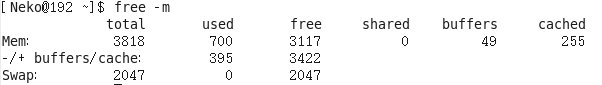

剩余的真实可以用的内存为3422mb

Swap：用于临时内存，当系统真实内存不够用的时候可以临时使用磁盘空间来充当内存

## 3、head指令

用于查看一个文件的前n行，不指定n则默认显示前十行

	#head -n 文件路径 （n表示数字）
```
案例：显示一个文件的前5行

	#head -5 linux.txt

```
## 4、tail指令
用于查看一个文件的后n行，不指定n则默认显示后十行

	#tail -n 文件路径 （n表示数字）
```
案例：显示一个文件的后5行

	#tail -5 linux.txt

案例：查看一个文件的动态变化（变化的内容不能是用户通过vim手动添加的）

	#tail -f linux.txt

	该命令一般用于查看系统的日志比较多

案例：查看一个文件的动态变化（变化的内容可以是用户通过vim手动添加的）

	#tail -F linux.txt
```
## 5、less指令

查看文件，以较少的内容进行输出，按下辅助功能键查看更多

	#less 需要查看的文件路径

数字+回车（第几行开始显示）、空格键（翻页）+上下方向键（按行查看）
## 6、wc指令

统计文件内容信息（包含行数、单词数、字节数）

	#wc -lwc 需要统计的文件路径

	-l：lines，行数
	-w：words，单词数（系统按空格区分单词）
	-c：Byte-code，字节数

## 7、date指令

表示操作时间日期（读取、设置）
	
	#date  		输出形式：2018 年 3 月 24 日 星期六 15:54:28

	#date +%F 	（等价于#date "%Y-%m-%d"）输出形式：2018-3-24

	#date "+%F %T"	（引号表示让“年月日与时分秒”成为一个不可分割的整体，等价操作#date "+%Y-%m-%d %H:%M:%S"）输出形式：2018-03-24 16:01:00

	获取之前或者之后的某个时间（多用于备份）

	#date -d "-1 day" "+%Y-%m-%d %H:%M:%S" （获取一天前的时间）

	符号可选值：+（之后） 或者 -（之前）

	单位可选值：day（天）、mouth（月份）、year（年）

## 8、cal指令
用来操作日历

	#cal		（等价于cal -1）直接输出当前月份的日历
	#cal -3			表示输出上个月+本月+下个月的日历
	#cal -y 年份	表示输出某一年份的日历

## 9、clear/ctrl+l指令
用于清除终端中已经存在的命令和结果（信息）。
	
	#clear 或者快捷键 ctrl+l

需要注意的是，该命令并不是真的清除了之前的信息，而是把之前的信息的隐藏到了最上面，通过滚动条继续查看以前的信息。
## 10、管道
管道符：|
管道一般可以用于“过滤”，“特殊”，“扩展处理”。
管道不能单独使用，必须配合其他指令，其作用主要是辅助作用

```
过滤案例：
需要通过管道来查询出根目录下包含"y"字母的文档名称
	
	#ls /| grep y

1、以管道作为分界线，前面的命令有个输出，后面需要先输入，然后再过滤，最后再输出，通俗的讲就是管道前面的输出就是后面指令的输入
2、/ 表示根目录
3、grep指令：主要用于过滤

特殊案例：
通过管道的操作方法实现less的等价效果（了解）

之前通过less查看一个文件，可以#less 路径
现在通过管道还可以这么： #cat 路径 | less

扩展处理：
请使用学过的命令，来统计某个目录下的文档的总个数?

	#ls /| wc -l
```

# 高级指令
## 1、hostname指令
用于操作服务器主机名（读取、设置）

	#hostname		输出完整主机名
	#hostname -f	输出当前主机名的FQDN（全限定域名）
## 2、id指令
查看一个用户的一些基本信息(包含用户id,用户组id,附加组id..)，该指令如果不指定用户则默认当前用户

	#id		默认显示当前执行该命令的用户的基本信息
	#id 用户名		显示指定用户的基本信息
	
验证上述信息是否正确?(使用cat命令查看)

验证用户信息：通过文件/etc/passwd

验证用户组信息：通过文件/etc/group
## 3、whoami指令
显示当前登录的用户名，一般用于shell脚本，用于获取当前操作的用户名方便记录日志

	#whoami
## 4、ps指令
用于查看服务器的进程信息

	#ps -ef

	-e 等价于“-A",表示列出全部的进程

	-f 显示全部的列(显示全字段)

执行结果

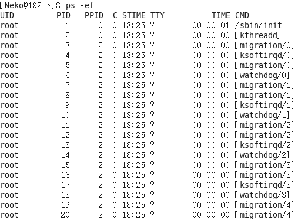

```
列的含义：

UID ：该进程执行的用户id ;

PID：进程id ;

PPID ：该进程的父级进程id, 如果一个程序的父级进程找不到，该程序的进程称之为僵尸进程;

C ： Cpu的占用率，其形式是百分数;

STIME ：进行的启动时间;

TTY ：终端设备，发起该进程的设备识别符号，如果显示"?”则表示该进程并不是由终端设备发起;

TIME ：进程的执行时间;

CMD ：该进程的名称或者对应的路径;
```

```
案例：在ps的结果中过滤出想要查看的进程状态
	#ps -ef | grep 进程名称
````
## 5、top指令
查看服务器进程所占资源

	#top	（动态显示）

	按下q键退出
执行结果

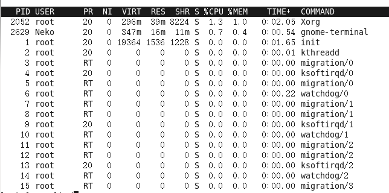
```
表头含义：

PID：进程id;

USER ：该进程对应的用户;

PR：优先级;

NI：用户进程空间内改变过优先级的进程占用CPU百分比;

NI和PR都表示进程优先级，NI是静态优先级，PR是动态优先级，下方有详解链接
```
<https://blog.csdn.net/ningmengban/article/details/124343962>
```
VIRT ：虚拟内存;

RES ：常驻内存;

SHR ：共享内存;

计算 = 一个进程实际使用的内存 = 常驻内存(RES) - 共享内存(SHR)

S ：表示进行的状态(sleeping), 其中S表示睡眠，R表示运行;

%CPU：表示CPU的占用百分比;

%MEM ：表示内存的占用百分比;

TIME+ ：执行的时间;

COMMAND ：进程的名称或者路径;
```
在运行top的时候，可以按下方便的快捷键：

M：表示将结果按照内存(MEM)从高到低进行降序排列，

P：表示将结果按照cpu使用率从高到低进行降序排列;

1：当服务器拥有多个cpu的时候可以使用“1”快捷键来切换是否展示显示各个cpu的详细信息

## 6、du -sh 指令

查看目录的真实大小

	选项含义：

	-s：summarise，只显示汇总的大小

	-h：表示以高可读性的形式进行显示

```
案例：统计目录的实际大小
	
	#du -sh /root/xj
```
## 7、find指令
用于查找文件(其参数有55个之多)

	#find 路径范围 选项 选项的值

	-name：按照文档名称进行搜索(支持模糊搜索)
	
	-type：按照文档的类型进行搜索

	文档类型：“-”表示文件(在使用find的时候需要用f来替换)，“d”表示文件夹
```
案例：使用find来搜索httpd.conf

	#find / -name httpd.conf

案例：搜索etc目录下所有的conf后缀文件

	#find /etc -name *.conf

案例：搜索etc目录下所有的conf后缀文件

	#find /etc -name *.conf	

案例：使用find来搜索/etc/sane.d/目录下所有的文件

	#find /etc/sane.d/ -type f
```
## 8、service * start/stop/restart指令

用于控制一些软件的服务启动/停止/重启

	#service 服务名start/stop/restart
```
案例：需要启动本机安装的Apache（网络服务软件），其服务名httpd
	#service httpd start
```
## 9、kill指令
杀死进程	（当遇到僵尸进程或者出于某些原因需要关闭进程的时候）
	
	#kill 进程PID	（语法需要配合ps一起使用）

与kill命令作用相似但是比kill更加好用的杀死进程的命令：killall

	#killall 进程名称

## 10、ifconfig指令
用于操作网卡的指令

	#ifconfig	（获取网卡信息）

执行结果

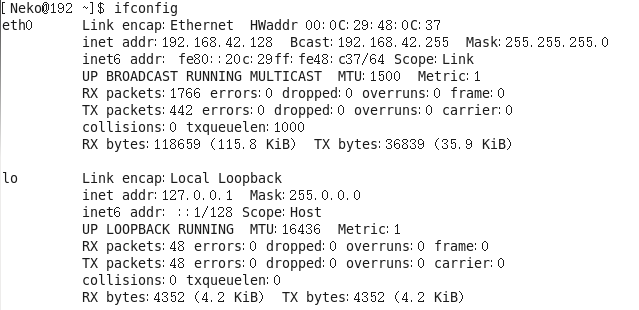

eth0表示linux中的一个网卡，etho 是其名称。

lo (loop,本地回还网卡，其ip地址一般都是127.0.0.1)也是一个网卡名称。

注意：inet addr就是网卡的ip地址。

## 11、reboot指令

重新启动计算机

	#reboot		重启系统
	#reboot -w	模拟重启，但是不重启（只写关机和开机的日志信息，测试用）

## 12、shutdown指令
关机（慎用）

	#shutdown -h -now 或者 #shutdown -h 15：25"关机提示" 立即关机
```
案例：设置Linux系统关机时间在12：00

	#shutdown -h 12：00 "系统将在12：00关机，请保存好你的文档"

如果想要取消关机计划的话，则可以按照以下方式去尝试：
针对于centos7.x 之前的版本： ctrl+c
针对于centos7.x (包含)之后的版本： #shutdown -c

除了shutdown关机以外，还有以下几个关机命令:
	#init 0
	#halt
	#poweroff
```
## 13、uptime指令
输出计算机的持续在线时间（计算机从开机到现在运行的时间）

	#uptime
	
## 14、uname指令

获取计算机操作系统相关信息

	#uname	获取操作系统的类型

	#uname -a	a即all,表示获取全部的系统信息(类型、全部主机名、内核版本、发布时间、开源计划)

## 15、netstat -tnlp指令

查看网络连接状态

	#netstat -tnlp

执行结果

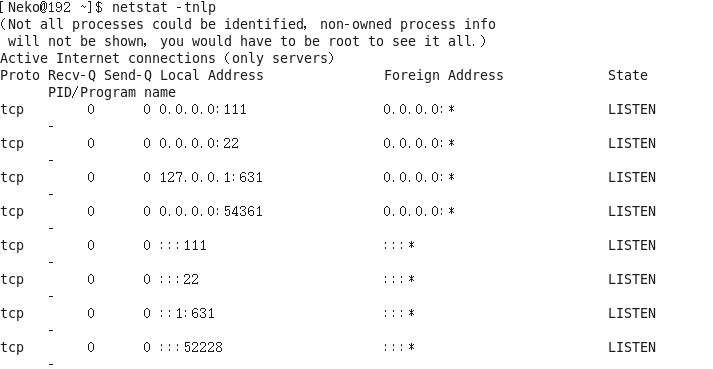
```
选项说明:

-t：表示只列出tcp协议的连接;

-n：表示将地址从字母组合转化成ip地址，将协议转化成端口号来显示;

-l：表示过滤出“state (状态)”列中其值为LISTEN (监听)的连接;

-p：表示显示发起连接的进程pid和进程名称;
```
## 16、man指令

(mannual，手册，包含了linux中全部命令手册，英文)

	#man 命令	（退出按下q键）

```
案例：通过man命令查询cp指令的用法
	
	#man cp
```
# VIM
## 一、vim三种模式(重点)

Vim中存在三种模式(大众的认知):命令模式、编辑模式(输入模式)、末行模式(尾行模式)。
```
命令模式：
在该模式下是不能对文件直接编辑，可以输入快捷键进行一些操作(删除行，复制行，移动光标，粘贴等等);

编辑模式：
在该模式下可以对文件的内容进行编辑;

末行模式：
可以在末行输入命令来对文件进行操作(搜索、昔换、保存、退出、撤销、高亮等等)
```
```
Vim的打开文件的方式(4种):
	#vim文件路径					作用:打开指定的文件
	#vim +数字 文件的路径		作用:打开指定的文件，并且将光标移动到指定行
	#vim +/关键词 文件的路径		作用:打开指定的文件，并且高亮显示关键词
	#vim文件路径1  文件路径2  文件路径3		作用: 同时打开多个文件
```
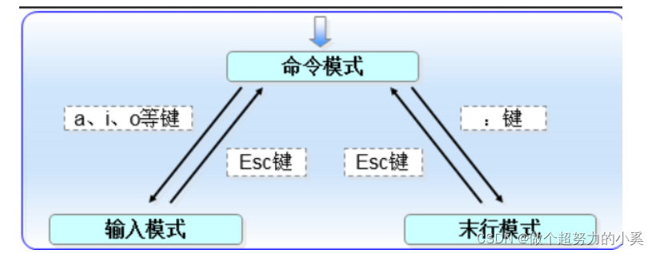

## 1、命令模式

### 1.1、光标移动


```
扩展

Ctrl+G  显示信息行

快速将光标移动到指定的行
按键:数字G

以当前光标为准向上向下移动n行
按键:数字↑，数字↓

以当前光标为准向左/向右移动n字符
按键:数字←，数字→

末行模式下的快速移动方式:移动到指定的行
按键:输入英文“:”，其后输入行数数字，按下回车
```

### 1.2、删除、复制、粘贴
	operator 【number】 motion

	operator -操作符，代表要做的事情

	number -可以附加的数字，代表次数

	motion -动作，例如w代表单词，$代表行末

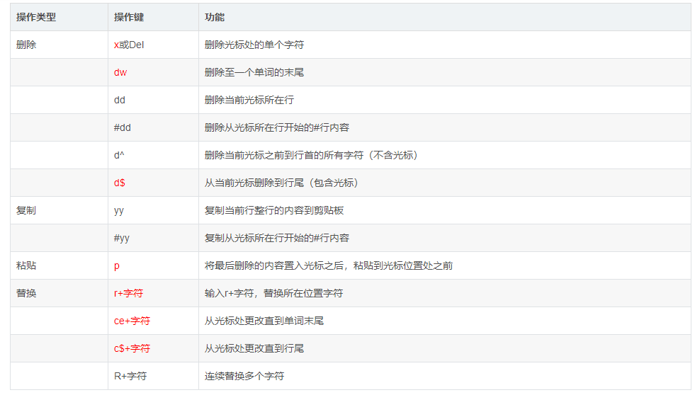
```
	可视化复制
	按键: v，然后按下↑↓←→方向键来选中需要复制的区块，按下yy键进行复制，最后按下p键粘贴

	可视化块复制
	按键: ctrl + v，然后按下↑↓←→方向键来选中需要复制的区块，按下yy键进行复制，最后按下p键粘贴
```
```
案例：复制粘贴文本

v,进入可视模式,移动光标位置,输入y复制文本,j$移动到下行末尾,输入p粘贴

```
### 1.3、撤销与恢复

	撤销:输入:u 或者 u (undo)

	恢复:ctrl+ r	恢复(取消)之前的撤销操作

	ZZ	保存当前的文件内容并退出vi编辑器


##	2、末行模式

```
进入方式:由命令模式进入，按下“:”或者“/ (表示查找)”即可进入
退出方式:
	a.按下esc
	b.连按2次esc键
	c. 删除末行全部输入字符
```
### 2.1、保存文件及退出vi编辑器
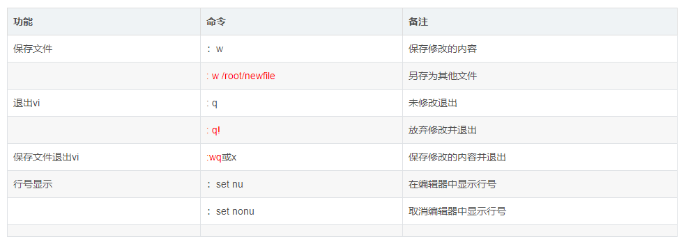

	在vim内执行外部命令
	：!（+外部命令）     执行外部命令，按回车enter返回vim内部

### 2.2、打开新文件或读入其他文件内容
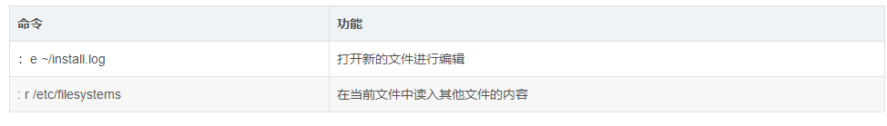

### 2.3、文件内容查找（区别大小写）
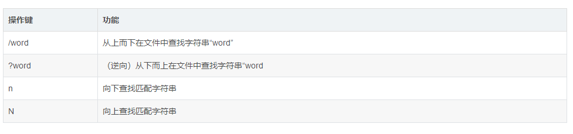
如果需要取消高亮，则需要输入:“:nohl"即[no highlight]
### 2.4、替换命令
```
:s/搜索的关键词/新的内容		替换光标所在行的第一处符合条件的内容
:s/搜索的关键词/新的内容/g	替换光标所在行的全部符合条件的内容
:%s/搜索的关键词/新的内容	替换整个文档中每行第一个符合条件的内容
:%s/搜索的关键词/新的内容/g	替换整个文档的符合条件的内容

%表示整个文件
g表示全局(global)
```
	拓展

	使用vim同时打开多个文件，在末行模式下进行切换文件

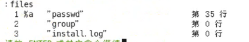

	
	在a的位置有2种显示可能
	%a : a=active,表示当前正在打开的文件;
	# ：表示上一个打开的文件

	切换文件的方式:
	a.如果需要指定切换文件的名称，则可以输入:“:open group”

	b.可以通过其他命令来切换上一个文件/下一个文件
	输入:“:bn” 切换到下一个文件(back next)
	输入:“:bp” 切换到上一个文件(back previous)

##	3、编辑模式
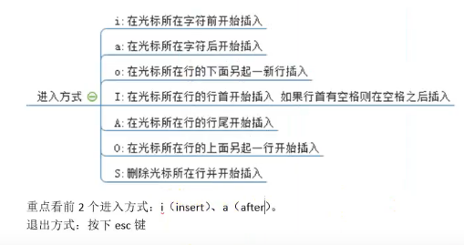

## 拓展功能

### 1、代码着色
```
案例：首先创造简单的c语言文件
	touch hello.c
	vim hello.c

文件内容如下
```
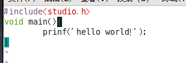

输入syntax off/on可以暂时关闭或打开代码着色功能

### 2、vim计算器功能
当在编辑文件的时候突然需要使用计算器去计算一些公式，则此时需要用计算器，但是需要退出，vim自身集成了一个简易的计算器。
```
a.进入编辑模式
b.按下按键“ctrl+R"， 然后输入“=”，此时光标会变到最后一行
C.输入需要计算的内容，按下回车
```
### 3、vim的配置
```
Vim是一款编辑器，编辑器也是有配置文件的。
Vim配置有三种情况:

a.在文件打开的时候在末行模式下输入的配置(临时的)

b.个人配置文件(~/.vimrc) 此文件一般不存在

c.全局配置文件(vim 自带,/etc/vimrc)

①新建好个人配置文件之后进入编辑
②在配置文件中进行配置
比如显示/不显示行号:
set nu/nonu
配置好之后vim打开文件就会永远显示行号

问题:如果某个配置项，在个人配直文件与全局配置文件产生冲突的时候应该以谁为准?

测试步骤:在两个配置文件中针对同一个配置项设置不同的值

①先在全局的配置中设置不显示行号，在个人的配置文件中设置显示行号，观察结果
最后显示行号，说明以个人为准

②先在全局中配置显示行号，在个人中设置不显示行号，观察结果
最后的显示是不显示行号，说明以个人为准

结论:如果针对同一个配置项，个人配置文件中存在，则以个人配置文件为准，如果个人
配置文件中不存在这一项，则以全局配置文件为准。
```
### 4、异常退出问题
什么是异常退出:在编辑文件之后并没有正常的去wq (保存退出)，而是遇到突然关闭终端或者断电的情况，则会显示下面的效果，这个情况称之为异常退出

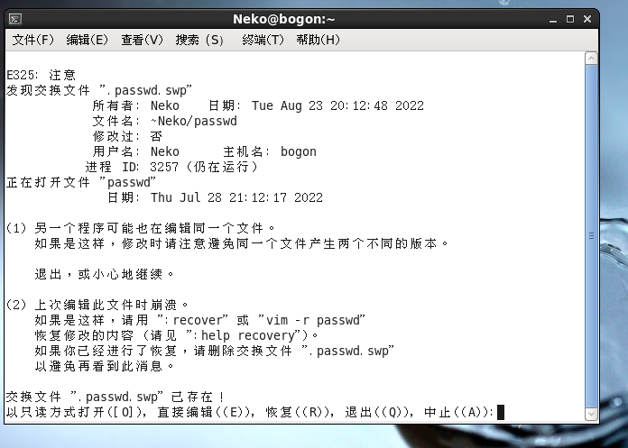

	解决办法:将交换文件(在编程过程中产生的临时文件)删除掉即可
	#rm -f .passwd.swp

### 5、别名机制
作用:相当于创建一些属于自己的自定义命令。
```
例如:在windows下有cls命令，在Linux下可能因为没有这个命令而不习惯清屏。

现在可以通过别名机制来解决这个问题，可以自己创造出cls命令。

别名机制依靠一个别名映射文件: ~/.bashrc
```
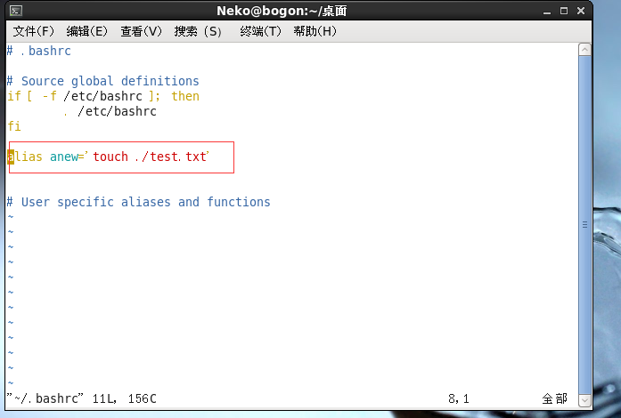
```
如图，创建了一个名为anew的命令，功能为在当前目录创建一个test.txt文件

注意:新创建的命令需要重新打开终端才能使用
```
### 6、退出机制

```
回顾:之前vim中退出编辑的文件可以使用“:q”或者“:wq”。
除了上面的这个语法之外，vim 还支持另外一个保存退出方法“:x”

说明:
①“:x”在文件没有修改的情况下，表示直接退出，在文件修改的情况下表示保存并退出;

②如果文件没有被修改，但是使用wq进行退出的话，则文件的修改时间会被更新;
但是如果文件没有被修改，使用x进行退出的话，则文件修改时间不会被更新的。

主要是会混淆用户对文件的修改时间的认定。
因此建议以后使用“:x” 来进行对文件的保存退出。
但是:不要使用X，不要使用X，不要使用X。

大写的X表示对文件的加密操作
```
